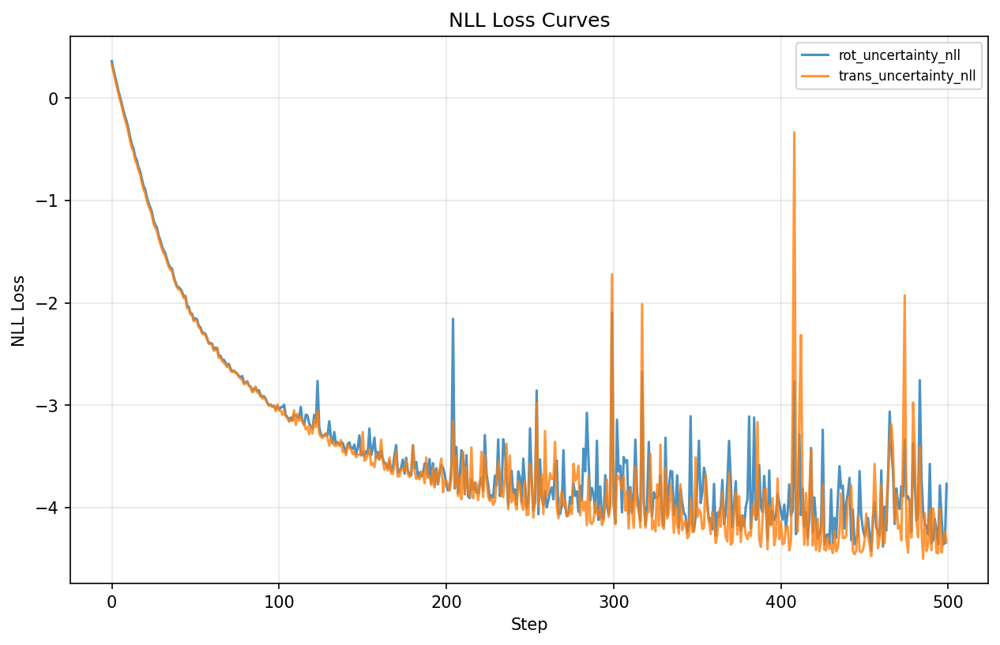
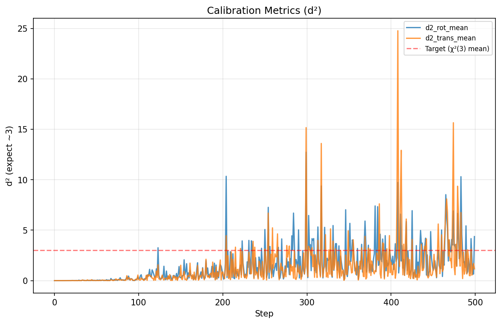
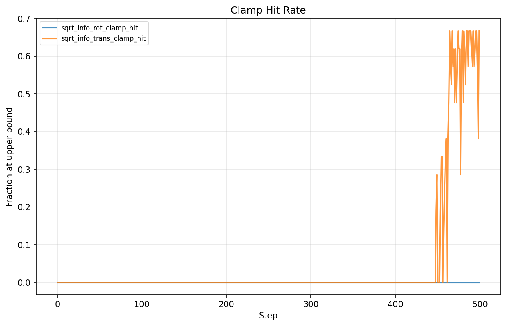
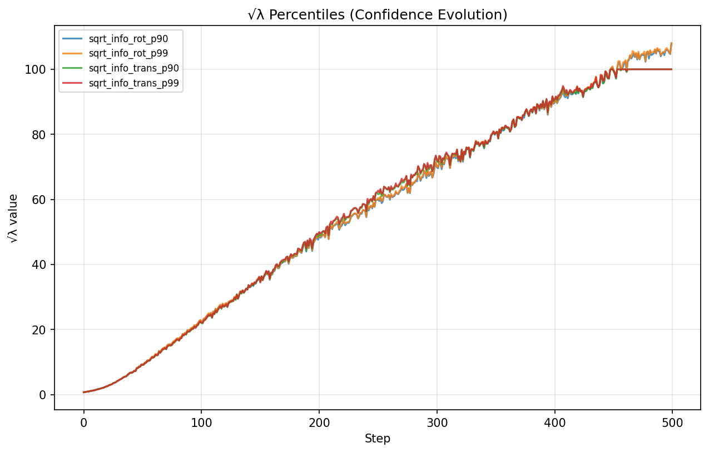
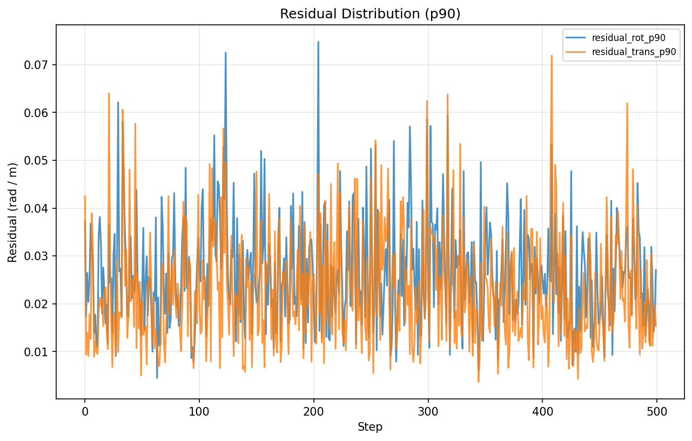
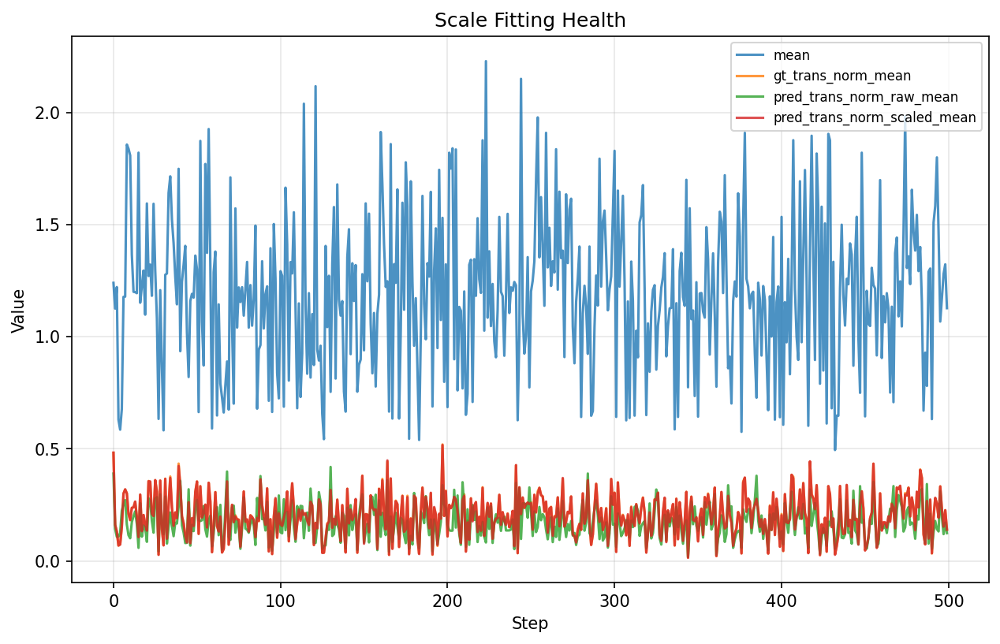

# Pose Uncertainty Head Training Analysis

This document records the training analysis and diagnostic findings for the VGGT pose uncertainty head.

## Overview

We trained a pose uncertainty head on top of VGGT's frozen backbone and pose head. The uncertainty head predicts a 6-dim diagonal information matrix (3 rotation + 3 translation) using NLL loss.

**Training Setup:**
- Dataset: TUM RGB-D (single sequence: freiburg1_desk, 596 frames)
- Batch: 8 frames per window
- Optimizer: AdamW, lr=1e-4
- Trainable params: 2.1M (uncertainty MLP only)
- Loss: NLL with SE(3) residuals

## Key Metrics Explained

| Metric | Description | Expected Value |
|--------|-------------|----------------|
| `d²_rot` | Mahalanobis distance squared for rotation | ~3 if calibrated |
| `d²_trans` | Mahalanobis distance squared for translation | ~3 if calibrated |
| `sqrt_info_rot_p90` | 90th percentile of √λ for rotation | Should not hit upper clamp (200) |
| `sqrt_info_trans_p90` | 90th percentile of √λ for translation | Should not hit upper clamp (100) |
| `clamp_hit` | Fraction of √λ values at upper bound | Should be 0 |
| `residual_rot_p90` | 90th percentile rotation error (radians) | Depends on model quality |
| `residual_trans_p90` | 90th percentile translation error (meters) | Depends on model quality |

**Calibration interpretation:**
- `d² < 3`: Underconfident (σ too large, uncertainty overestimated)
- `d² ≈ 3`: Well-calibrated
- `d² > 3`: Overconfident (σ too small, uncertainty underestimated)

## Training Run: 500 Iterations

**WandB Run:** [uncertainty_20260127_152049](https://wandb.ai/yimingc-university-of-california-riverside/vggt-uncertainty/runs/zff3gqgb)

### Loss Curves



The NLL loss shows characteristic behavior:
- Rapid decrease in early iterations (model learning to predict reasonable uncertainties)
- Negative loss values (expected when √λ becomes large, -log(λ) dominates)
- Occasional spikes after step 200 (overconfidence correction)

### Calibration Evolution



| Step | d²_rot | d²_trans | sqrt_info_rot_p90 | Status |
|------|--------|----------|-------------------|--------|
| 100 | 0.39 | 0.55 | ~25 | Underconfident |
| 200 | 1.01 | 0.78 | ~50 | Approaching calibration |
| 300 | **12.73** | **15.17** | ~75 | Spike! Both overconfident |
| 500 | 4.37 | 1.16 | **108** | Rotation overconfident |

### Key Findings

1. **Progressive confidence increase**: `sqrt_info_rot_p90` steadily increases from 25 to 108 (54% of upper bound 200)

2. **Severe overconfidence spike at step 300**: Both d²_rot = 12.73 and d²_trans = 15.17 (expect ~3)

3. **Translation clamp collapse**: By step 500, 67% of translation √λ values hit the upper bound (100)

4. **Loss spikes = overconfidence correction**: When d² >> 3, NLL loss spikes to penalize overconfident predictions, but hard clamp prevents recovery

### Diagnostic Metrics Analysis

#### A) Clamp Hit Rate



```
sqrt_info_rot_clamp_hit: 0 (rotation not hitting upper bound 200)
sqrt_info_trans_clamp_hit: 0.67 (67% of translation values at upper bound 100!)
```
**Warning:** Translation √λ is collapsing to upper clamp. This causes severe overconfidence and unstable training (d² spikes up to 15 at step 300).

#### B) Percentile Evolution



```
sqrt_info_rot_p90: 23 → 113 (steadily increasing)
sqrt_info_rot_p99: (higher, closer to clamp)
```
Warning sign - model is becoming increasingly confident.

#### C) Residual Distribution



```
residual_rot_p90: ~0.025 rad ≈ 1.4°
residual_trans_p90: 0.02 → 0.05 m (increasing with harder batches)
```
Residuals are reasonable, suggesting pose predictions are decent.

#### D) Scale Fitting Health



Scale fitting is working correctly - `pred_trans_norm_scaled_mean` closely tracks `gt_trans_norm_mean`.

## Interpretation

The training dynamics show:

1. **Early phase (0-100)**: Model is underconfident, rapidly increasing confidence
2. **Middle phase (100-300)**: Approaching calibration, occasional overconfidence spikes
3. **Late phase (300-500)**: Systematic overconfidence, especially for translation

The loss spikes after step 200 are **healthy behavior** - they indicate the NLL loss is correctly penalizing overconfident predictions. Without these spikes, the model would collapse to predicting zero uncertainty.

## Recommendations

### Priority 1: Log-Variance Parameterization (Recommended)

**Problem with current approach:**
```python
# Current: Network -> softplus -> clamp
sqrt_info = softplus(raw) + eps  # Can grow unboundedly toward clamp
sqrt_info = sqrt_info.clamp(max=100)  # Hard wall, gradient = 0
```
- Model tends to push sqrt_info larger (reduces -log(λ) term in NLL)
- Once hitting clamp, gradient vanishes, cannot self-correct

**Solution: Output log(σ²) directly**
```python
# Network directly outputs log(variance)
log_var = network_output  # No activation needed!
# NLL = 0.5 * (r²/σ² + log(σ²)) = 0.5 * (r² * exp(-log_var) + log_var)
nll = 0.5 * (residual_sq * torch.exp(-log_var) + log_var)
```

**Advantages:**
1. **Naturally centered**: log_var=0 means σ=1 (reasonable default)
2. **Symmetric gradients**: Similar cost to move in either direction
3. **Easy regularization**: Add `λ_reg * log_var²` to penalize extreme values
4. **No hard clamp needed**: Or use much looser clamp (e.g., [-20, 20])

**Relationship to current parameterization:**
```
sqrt_info = √λ = 1/σ = exp(-0.5 * log_var)
log_var = -2 * log(sqrt_info)
```

### Priority 2: Add Weak Prior to √λ (Minimal Change)

Add a regularization term that pulls log(√λ) back to a reasonable center:

```
L_prior = α * ||log(√λ) - log(√λ₀)||²
```

**Intuition:** Tell the model "don't be infinitely confident unless data strongly supports it."

**Practical tuning:**
- Start with α = 1e-4 ~ 1e-3
- Set √λ₀ = 5~20 (depending on residual units), or simply √λ₀ = 1

This is easy to implement and can be combined with current softplus+clamp approach.

### Priority 3: Normalize Translation NLL by Motion

**Problem:** When most frames in a window have little motion, residuals are small, pushing λ to be large. Although we mask static frames for scale fitting, NLL still learns strongly from these "low-information windows."

**Solution:** Weight each window by valid_count or gt_trans_norm_mean, reducing weight for low-motion windows (especially for translation component):

```python
# Per-window weight based on motion
motion_weight = gt_trans_norm_mean / gt_trans_norm_mean.mean()
motion_weight = motion_weight.clamp(min=0.1, max=2.0)  # Prevent extremes
nll_trans_weighted = nll_trans * motion_weight
```

### Other Suggestions

- **Lower learning rate after step 200**: Reduce LR when d² approaches 3 to stabilize
- **More diverse data**: Single TUM sequence may cause overfitting
- **Early stopping**: Monitor d² and stop when it stabilizes around 3

## Final Metrics Summary

| Metric | Final Value |
|--------|-------------|
| `loss/pose_uncertainty_nll` | -2.18 |
| `calibration/d2_rot_mean` | 4.37 |
| `calibration/d2_trans_mean` | 1.16 |
| `diagnostic/sqrt_info_rot_p90` | 107.86 |
| `diagnostic/sqrt_info_trans_p90` | **100.0000** (at upper bound!) |
| `diagnostic/sqrt_info_rot_clamp_hit` | 0 |
| `diagnostic/sqrt_info_trans_clamp_hit` | **0.6667** (67% at clamp!) |
| `diagnostic/residual_rot_p90` | 0.0271 rad |
| `diagnostic/residual_trans_p90` | 0.0153 m |

**Critical Finding:** Translation uncertainty is collapsing to the upper clamp (67% hit rate). The translation clamp collapse causes unstable d² metrics with spikes up to d²=15 during training (see step 300).

## Visualization Links

- **WandB Project:** https://wandb.ai/yimingc-university-of-california-riverside/vggt-uncertainty
- **TensorBoard:** Run `tensorboard --logdir ./runs` locally

### Exporting Charts

Use the export script to generate PNG charts from any WandB run:
```bash
python training/tests/export_wandb_charts.py \
    --run_path USER/PROJECT/RUN_ID \
    --output_dir docs/figures
```

## Appendix: Metric Definitions

### NLL Loss Formula
```
L_nll = 0.5 * Σᵢ (rᵢ² * λᵢ - log(λᵢ))
```
where:
- `rᵢ` = SE(3) residual (6-dim: 3 trans + 3 rot)
- `λᵢ` = information (inverse variance) = √λ²
- `√λ` = sqrt_info (what the network predicts)

### d² (Mahalanobis Distance Squared)
```
d² = Σₖ λₖ * rₖ²
```
For a well-calibrated Gaussian, `d²` follows χ²(n) distribution:
- n=3 for rotation (3 DOF) → E[d²] = 3
- n=3 for translation (3 DOF) → E[d²] = 3

### Scale Fitting
Per-window scale fitted using camera positions:
```
s* = Σ(t_gt · t_pred) / Σ||t_pred||²
```
Applied to handle monocular scale ambiguity.
